# Sentiment Analysis

### Experimenting With Multiple Models and Datasets

Sentiment analysis was attempted with different approaches.
- [Average Pooling](helpers/models.py?plain=1#L12)
- [RNN (RNN/ GRU/ LSTM)](helpers/models.py?plain=1#L40)
- [Transformer](helpers/models.py?plain=1#L178)

2 datasets were used.
- [IMDb Reviews](https://ai.stanford.edu/%7Eamaas/data/sentiment/)
- [Sentiment140 (Twitter)](http://help.sentiment140.com/for-students)

### Requirements
The [following packages](requirements.txt) were used with Python 3.8. 
Feel free to experiment with different versions.
```
tensorflow==2.11.0
matplotlib==3.5.3
pandas==1.3.5
```

### Naming Convention
- **{MODEL_ID}** looks like **{MODEL_TYPE}-{DATASET_NAME}-{SAVED_TIMESTAMP_UTC}** (eg: Average-aclImdb-2023-02-24-04-10-16)
- **{MODEL_TYPE}** could be **Average/LSTM/Transformer/GRU/RNN**
- **{DATASET_NAME}** could be **aclImdb/sentiment140**
- **{SAVED_TIMESTAMP_UTC}** has **YYYY-MM-DD-HH-mm-ss** format
- **{GRAPH_TYPE}** could be **accuracy/loss**

### Quickstart to Training
_(Assuming the requirements are fulfilled)_
```
python train.py
```
The above commands will do the follwing.
- Download IMDb reviews dataset
- Start training the Average Pooling model with the [default configurations](helpers/config.py)
- Save the **accuracy** and **loss** graphs as `svg` images to `results/{MODEL_ID}-results/{MODEL_ID}-{GRAPH_TYPE}.svg`
- Write the model summary and configurations to `results/{MODEL_ID}-results/{MODEL_ID}.txt`
- Save the model as a tf `savedModel` to `saved_models/{MODEL_ID}-model`

### Quickstart to Testing
_(Assuming the requirements are fulfilled)_
1. Download a `savedModel` zip from [this Google Drive folder](https://drive.google.com/drive/folders/12eBUOl5IeWdmyF8i6J7E8ZdtXHt9MUeS?usp=share_link)
    - Models are zipped as **"{MODEL_ID}-model.zip"** (eg: Average-aclImdb-2023-02-24-04-10-16-model.zip)
2. Extract the zip file into the `saved_models` sub-folder
    ```
    Now, the file tree should look as follows.
    
    saved_models/
        |---{MODEL_ID}-model/
                |---assets/
                |---variables/
                |       |---variables.data-00000-of-00001
                |       |---variables.index
                |---fingerprint.pb
                |---saved_model.pb
    ```
3. Set the `model_id` in [test.py](test.py?plain=1#L10) according to the downloaded model
4. Run `test.py`
    ```
    python test.py
    ```

### Results
Following results were obtained when trained with [default configurations](helpers/config.py). 
Model summaries and configurations can be found as `txt` files in subdirectories in `results` directory.
With **default configurations**, in most cases models are **overfitting**. 
One can change the configurations and use methods like early-stopping to mitigate this issue.
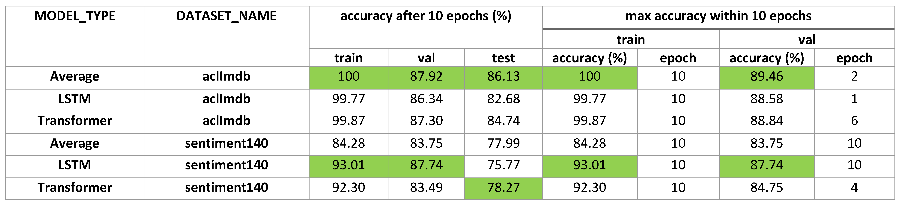

### Graphs
Following graphs were obtained when trained with [default configurations](helpers/config.py).
With those configurations, in most cases models are **overfitting**. 
One can change the configurations and use methods like early-stopping to mitigate this issue.

|MODEL_TYPE|DATASET_NAME|accuracy|loss|
|:---:|:---:|:---:|:---:|
|Average|aclImdb|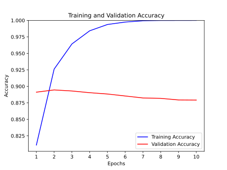|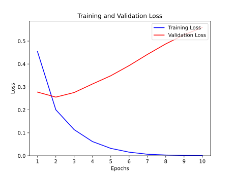|
|LSTM|aclImdb|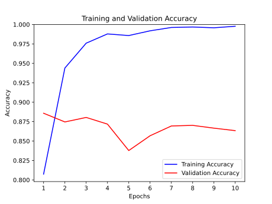|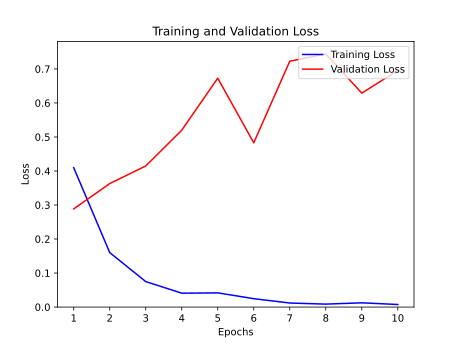|
|Transformer|aclImdb|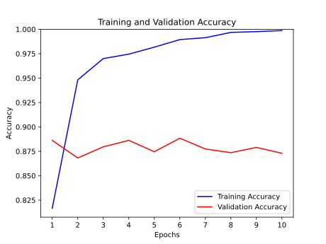|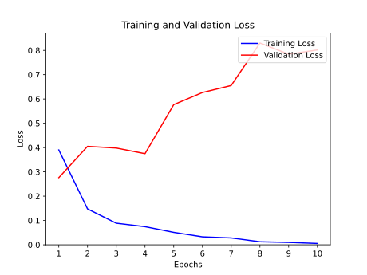|
|Average|sentiment140|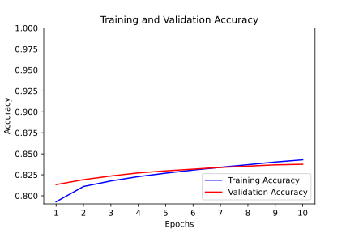|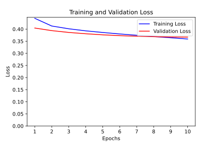|
|LSTM|sentiment140|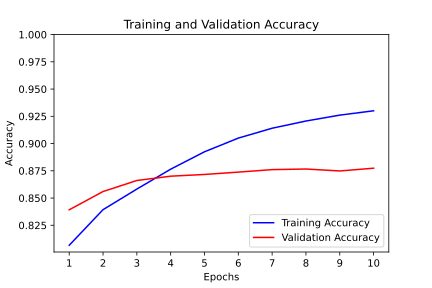|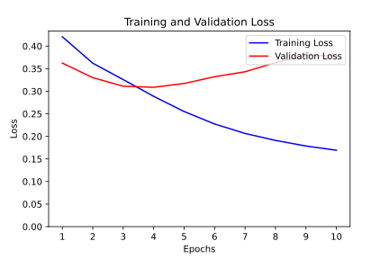|
|Transformer|sentiment140|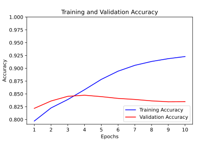|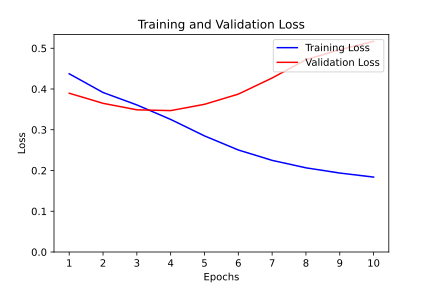|

### Notes
- [analyze_ds.py](helpers/analyze_ds.py) can be used to find a rough [MAX_SEQUENCE_LENGTH](helpers/config.py?plain=1#L13) for IMDb dataset
(Need to set [BATCH_SIZE](helpers/config.py?plain=1#L7) as 1).
**MAX_SEQUENCE_LENGTH** is required for the [positional embedding](helpers/models.py?plain=1#L89-L152) of the transformer model.
- If you want to limit or pad the sequences to [SEQUENCE_LENGTH](helpers/config.py?plain=1#L14), set, 
    - **SEQUENCE_LENGTH** to a value less than or equal to **MAX_SEQUENCE_LENGTH**
    - [MASK_ZERO](helpers/config.py?plain=1#L22) to `False`.
- `MASK_ZERO = True` supports variable length sequences
(Make sure `SEQUENCE_LENGTH = None`).
To check whether a model supports **MASK_ZERO**,
    - Set `MASK_ZERO = True` and `SEQUENCE_LENGTH = None` in [config.py](helpers/config.py).
    - Run [check_mask_zero.py](check_mask_zero.py) after picking a [model](check_mask_zero.py?plain=1#L15-L17).
    - Check the last 3 printed lines.
        - Embedding layer and all the layers after that should support masking.
        - Printed values in the last 2 lines should be the same. 
- If you want to explore the IMDb dataset and use locally,
    - Download it from [this page](https://ai.stanford.edu/%7Eamaas/data/sentiment/).
    - Extract it to `data` directory. 
        ```
        Now, the folder structure should look as follows.
        
        data/
            |---aclImdb/
                    |---test/
                    |       |---neg/
                    |       |---pos/
                    |---train/
                            |---neg/
                            |---pos/
                            |---unsup/
        ```
    - Delete `data/aclImdb/train/unsup` since they are not required.
    - Use [dataset.py](helpers/dataset.py) in [train.py](train.py?plain=1#L11)
- If you want to explore the Sentiment140 dataset and use locally,
    - Download it from [this page](http://help.sentiment140.com/for-students).
    - Extract the `csv` files to `data/sentiment140` directory. 
        ```
        Now, the file tree should look as follows.
        
        data/
            |---sentiment140/
                    |---testdata.manual.2009.06.14.csv
                    |---training.1600000.processed.noemoticon.csv
        ```
    - Use [dataset_140.py](helpers/dataset_140.py) in [train.py](train.py?plain=1#L13)
- To train different models, pick one in [train.py](train.py?plain=1#L18-L20) and make the changes as you wish.
- If you want to use the positional embedding logic used in [this](https://www.tensorflow.org/text/tutorials/transformer#the_embedding_and_positional_encoding_layer), 
change the [transformer](helpers/models.py?plain=1#L183) to use the class `PositionalEmbedding` instead of `TokenAndPositionEmbedding`.

### References
- [tf basic text classification](https://www.tensorflow.org/tutorials/keras/text_classification)
- [tf text classification with RNNs](https://www.tensorflow.org/text/tutorials/text_classification_rnn)
- [tf translate text with transformers](https://www.tensorflow.org/text/tutorials/transformer)
- [keras text classification with a transformer](https://keras.io/examples/nlp/text_classification_with_transformer/)
